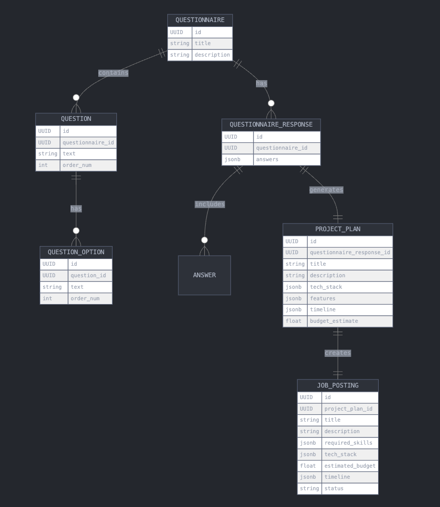

# AI CTO Project

## Table of Contents
- [Project Overview](#project-overview)
- [How It Works](#how-it-works)
- [Project Structure](#project-structure)
  - [Frontend](#frontend)
  - [Backend](#backend)
- [How the Backend Works](#how-the-backend-works)
- [Database Schema](#database-schema)
- [Deployment](#deployment)
  - [Frontend Deployment](#frontend-deployment)
  - [Backend Deployment](#backend-deployment)
- [How Vercel Works](#how-vercel-works)
- [Local Development](#local-development)
- [Sample API Response](#sample-api-response)
- [Contributing](#contributing)
- [License](#license)

## Project Overview

AI CTO is an innovative platform that leverages artificial intelligence to assist startups and businesses in creating comprehensive project plans and technical specifications. By answering a series of questions, users receive tailored project outlines, technology stack recommendations, and even job descriptions for key roles.

## How It Works

1. Users fill out a questionnaire about their project requirements.
2. The system processes the responses using an AI-powered assistant.
3. A detailed project plan is generated, including tech stack, features, timeline, and budget estimates.
4. Users can review and refine the generated plan.
5. The system can also create job postings based on the project requirements.

## Project Structure

The project is divided into two main components:

1. Frontend (Next.js application)
2. Backend (FastAPI service)

### Frontend

- Located in the `frontend/` directory
- Built with Next.js 14, React 18, and TypeScript
- Uses Tailwind CSS for styling
- Communicates with the backend API to submit questionnaires and receive project plans

### Backend

- Located in the `backend/` directory
- Built with FastAPI and Python 3.9+
- Uses Supabase for database operations
- Integrates with OpenAI's Assistant API for AI-powered project plan generation

## How the Backend Works

1. The backend receives questionnaire responses from the frontend.
2. It stores the responses in Supabase.
3. The OpenAI Assistant is invoked to process the questionnaire and generate a project plan:
   - **Create Thread**: A new thread is created to manage the conversation.
   - **Add User Messages**: User responses are added to the thread.
   - **Run Assistant**: The assistant processes the messages and generates a project plan.
   - **Check Run Status**: The backend checks the status of the assistant's processing in a loop until completion.
   - **Retrieve Messages**: Once completed, the backend retrieves the assistant's response.


4. The generated plan is stored in Supabase and returned to the frontend.

## Database Schema

The project uses a relational database to store user data, questionnaires, and generated project plans. Below is the entity-relationship diagram (ERD) of our database schema:



This schema illustrates the relationships between different entities in our system, such as users, projects, questionnaires, and generated plans.

## Deployment

The project is deployed using Vercel for both the frontend and backend components.

### Frontend Deployment

- The Next.js application is automatically deployed to Vercel.
- Vercel handles server-side rendering and static site generation.
- Environment variables are configured in the Vercel dashboard.

### Backend Deployment

- The FastAPI backend is deployed as a Vercel Serverless Function.
- A `vercel.json` file in the backend directory configures the deployment.
- Environment variables (e.g., API keys) are set in the Vercel dashboard.

## How Vercel Works

Vercel provides a seamless deployment experience for both frontend and backend:

1. It automatically detects the framework (Next.js for frontend, FastAPI for backend).
2. It builds the project according to the framework's requirements.
3. For the frontend, it optimizes assets and sets up serverless rendering.
4. For the backend, it packages the FastAPI app into serverless functions.
5. It provides automatic scaling, CDN distribution, and HTTPS encryption.

## Local Development

To run the project locally:

1. Clone the repository
2. Set up environment variables (see `.env.example` files in frontend and backend directories)
3. Install dependencies for both frontend and backend
4. Run the frontend development server: `npm run dev` in the frontend directory
5. Run the backend development server: `uvicorn app.main:app --reload` in the backend directory

## Sample API Response

Here's an example of the API response generated by the AI CTO system:
```Added message to thread mock_thread_123: I want to build a mobile app for task management
Added message to thread mock_thread_123: The app should have user authentication and cloud sync
Added message to thread mock_thread_123: The target audience is professionals and students
Added message to thread mock_thread_123: The budget is around $50,000
Added message to thread mock_thread_123: The timeline is 3 months
Generated Project Plan:
{
  "title": "Task Management Mobile App",
  "description": "A mobile application for efficient task management, targeting professionals and students.",
  "tech_stack": [
    "React Native",
    "Node.js",
    "MongoDB"
  ],
  "features": [
    "User authentication",
    "Cloud synchronization",
    "Task creation and management",
    "Priority setting",
    "Reminders and notifications"
  ],
  "timeline": {
    "Planning and Design": "2 weeks",
    "Development": "8 weeks",
    "Testing and QA": "2 weeks",
    "Deployment": "1 week"
  },
  "budget_estimate": 45000,
  "product_requirements": "The app should provide a seamless user experience for creating, organizing, and tracking tasks. It should include features such as user authentication, cloud synchronization, task creation and management, priority setting, and reminders.",
  "job_description": "We are seeking a skilled mobile app developer with experience in React Native and Node.js. The ideal candidate should have a strong understanding of user authentication, cloud synchronization, and building intuitive user interfaces.",
  "required_skills": [
    "React Native",
    "Node.js",
    "MongoDB",
    "RESTful API development",
    "User authentication and security",
    "Cloud synchronization",
    "Mobile UI/UX design principles"
  ]
}
Added message to thread mock_thread_123: I want to build a mobile app for task management
Added message to thread mock_thread_123: The app should have user authentication and cloud sync
Added message to thread mock_thread_123: The target audience is professionals and students
Added message to thread mock_thread_123: The budget is around $50,000
Added message to thread mock_thread_123: The timeline is 3 months
Generated Project Plan:
{
  "title": "Task Management Mobile App",
  "description": "A mobile application for efficient task management, targeting professionals and students.",
  "tech_stack": [
    "React Native",
    "Node.js",
    "MongoDB"
  ],
  "features": [
    "User authentication",
    "Cloud synchronization",
    "Task creation and management",
    "Priority setting",
    "Reminders and notifications"
  ],
  "timeline": {
    "Planning and Design": "2 weeks",
    "Development": "8 weeks",
    "Testing and QA": "2 weeks",
    "Deployment": "1 week"
  },
  "budget_estimate": 45000,
  "product_requirements": "The app should provide a seamless user experience for creating, organizing, and tracking tasks. It should include features such as user authentication, cloud synchronization, task creation and management, priority setting, and reminders.",
  "job_description": "We are seeking a skilled mobile app developer with experience in React Native and Node.js. The ideal candidate should have a strong understanding of user authentication, cloud synchronization, and building intuitive user interfaces.",
  "required_skills": [
    "React Native",
    "Node.js",
    "MongoDB",
    "RESTful API development",
    "User authentication and security",
    "Cloud synchronization",
    "Mobile UI/UX design principles"
  ]
}```
